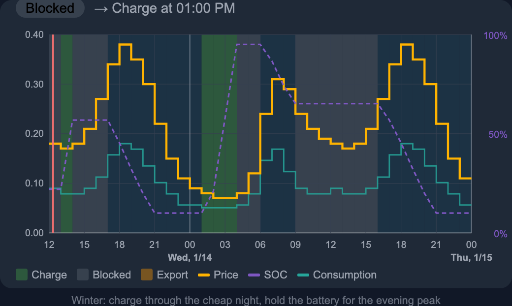
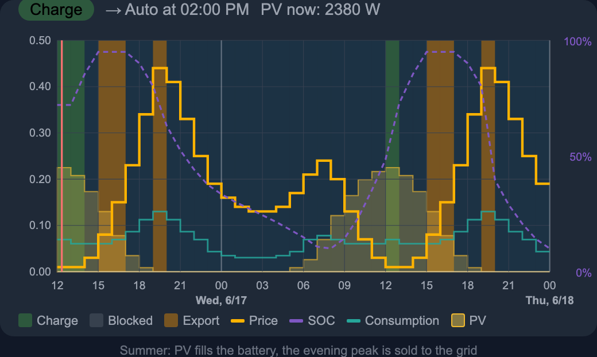
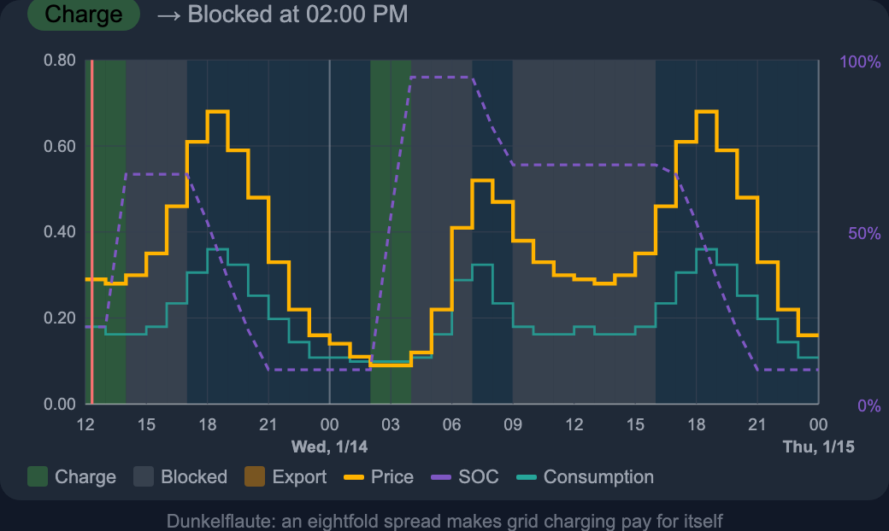

# Smart Battery Pilot

<p align="center">
  
</p>

[![GitHub Release][release-badge]][release-url]
[![GitHub Downloads (all assets, all releases)][downloads-badge]][release-url]
[![HACS Custom][hacs-badge]][hacs-url]
[![HA Version][ha-badge]][ha-url]
[![License][license-badge]][license-url]
[![GitHub commit activity][commits-badge]][commits-url]
[![Validate][validate-badge]][validate-url]
[![GitHub Stars][stars-badge]][stars-url]

**Charge your home battery when electricity is cheap — use it when it's expensive.**

Smart Battery Pilot is a Home Assistant integration for households with a home
battery and a dynamic electricity tariff (Tibber, aWATTar, Octopus Energy,
Ostrom, Voltego, Rabot Charge, Lichtblick, …). It learns your household's
consumption profile, combines it with
the price forecast for the next 24–36 hours and your PV production forecast,
and computes an optimal charge/discharge plan — especially valuable during
dark winter weeks ("Dunkelflaute") when prices swing heavily within a day.

The integration is **vendor neutral**: it controls your battery through Home
Assistant scripts that *you* define, so it works with any inverter/battery
combination that can be controlled from Home Assistant (Fronius, Victron, SMA,
Sungrow, E3DC, …). See [docs/examples](docs/examples/) for ready-to-use
vendor configurations.

## How it works

1. **Price forecast** — the price entity of your existing tariff integration is
   parsed automatically (15-minute or hourly slots, today + tomorrow). Supported
   price integrations: Nordpool, EPEX Spot, ENTSO-E, Tibber, aWATTar and any
   integration that exposes an hourly price list as a sensor attribute.
2. **Consumption forecast** — a lightweight model (pure Python, no heavy ML
   dependencies) is trained daily from your Home Assistant history: hour of
   day, weekday/weekend and optionally outdoor temperature (heat pump aware).
3. **PV forecast** — optional; expected solar production is subtracted so the
   plan only covers the *net* grid demand, and forecasted PV surplus is
   modeled as battery charging in the SOC simulation — so on sunny days the
   planner doesn't lock the battery needlessly.
4. **Optimization** — a deterministic planner pairs the cheapest charge slots
   with the most expensive consumption slots, respecting battery capacity,
   power limits, SOC limits and roundtrip efficiency. Charging only happens if
   the price spread exceeds your configured threshold (default 0.20 EUR/kWh).
5. **Execution** — at every slot boundary the integration calls your scripts:
   *force charge*, *block discharge (idle)*, *auto mode* or optionally
   *export to grid*.

### Actions

| Action   | Meaning                                                        |
|----------|----------------------------------------------------------------|
| `charge` | Force-charge from the grid at the planned power                |
| `auto`   | Inverter auto mode — battery covers household consumption      |
| `idle`   | Discharging blocked — preserve energy for more expensive hours |
| `export` | Force-discharge into the grid (optional arbitrage mode)        |

## Installation (HACS)

1. HACS → Integrations → ⋮ → *Custom repositories* →
   `https://github.com/cygnusb/ha-smart-battery-pilot` (category: Integration)
2. Install **Smart Battery Pilot** and restart Home Assistant.
3. Settings → Devices & Services → *Add Integration* → **Smart Battery Pilot**.

## Configuration

The config flow guides you through five steps: price source, battery
parameters, control scripts, consumption sensor and (optional) PV forecast.
Details and the full option reference: [docs/configuration.md](docs/configuration.md).

> **Safety first:** the integration starts **disabled** and in **dry-run**
> mode. Watch the planned actions in the log and the plan sensor for a day or
> two, then turn **on** the master switch (still dry-run) and only afterwards
> turn **off** dry-run.

## Entities

| Entity                                   | Description                                  |
|------------------------------------------|----------------------------------------------|
| `sensor.…_current_action`                | Action prescribed right now                  |
| `sensor.…_next_action`                   | Next action change (+ time, price)           |
| `sensor.…_current_price`                 | Price of the active plan slot                |
| `sensor.…_charge_plan`                   | Full plan as `slots` attribute               |
| `sensor.…_plan_status`                   | Plan validity (`ok` / `no_price_data` / …)   |
| `sensor.…_estimated_savings`             | Plan vs. doing nothing, over the horizon     |
| `sensor.…_actual_savings_eur`            | Accumulated EUR from energy-meter deltas (grid charge at import, PV charge at feed-in, export credited at feed-in) |
| `sensor.…_actual_savings_kwh`            | Accumulated kWh (discharge − grid charge)    |
| `sensor.…_consumption_forecast`          | Learned 24h consumption forecast             |
| `sensor.…_configuration`                 | Diagnostic dump of the active settings       |
| `switch.…_enabled`                       | Master switch                                |
| `switch.…_dry_run`                       | Plan only, don't call scripts                |
| `binary_sensor.…_plan_problem`           | On when no valid plan exists                 |

Actual-savings sensors stay empty until **both** optional battery charge and
discharge energy entities are configured — each reports a net figure, which a
single meter cannot produce.

`estimated_savings` is measured against doing nothing (plain self-consumption),
not against buying everything from the grid: a plan that changes nothing
reports `0.00`. See [docs/optimizer.md](docs/optimizer.md#savings-estimate).

> Entity IDs are generated from the **localized** entity names — on a German
> installation the plan sensor is `sensor.smart_battery_pilot_ladeplan`, on
> an English one `sensor.smart_battery_pilot_charge_plan`. The UI languages
> shipped are English and German.

Service: `smart_battery_pilot.replan` — recompute the plan immediately.

Diagnostics (⋮ → *Download diagnostics* on the device page) dump the active
configuration, the matched price adapter, the forecast model and the first day
of the plan — attach that to any issue report.

## Dashboard card

The integration ships its own Lovelace card (registered automatically as a
frontend module and lovelace resource):

```yaml
type: custom:smart-battery-pilot-card
entity: sensor.smart_battery_pilot_charge_plan   # optional - auto-discovered
```

It shows the price curve with a labeled price grid, the planned actions as
colored bands, the PV forecast, live PV power (if configured), the projected
SOC, day separators and a hover tooltip with price/SOC/action/PV per slot.
If `entity` is omitted or wrong, the card finds the plan sensor automatically.
See [docs/configuration.md](docs/configuration.md#dashboard).

Click any of them to open the full-resolution image.

| Winter arbitrage | Summer PV export | Dunkelflaute |
|:---:|:---:|:---:|
| <a href="assets/screenshots/card_winter_arbitrage.png"></a> | <a href="assets/screenshots/card_summer_export.png"></a> | <a href="assets/screenshots/card_dunkelflaute.png"></a> |

All three are real plans: [`tools/gen_card_screenshots.py`](tools/gen_card_screenshots.py)
describes a day of prices, consumption and PV, runs it through the actual
optimizer and renders the card against the result.

## Vendor examples

* [BYD Battery-Box Premium HVM + Fronius Gen24 (Modbus TCP)](docs/examples/byd-fronius-gen24.md)
* [Add your setup](docs/examples/TEMPLATE.md) — PRs welcome!

## How the optimizer decides

See [docs/optimizer.md](docs/optimizer.md) for the algorithm, the savings
estimate and worked examples.

## License

MIT

[release-badge]: https://img.shields.io/github/v/release/cygnusb/ha-smart-battery-pilot?include_prereleases
[release-url]: https://github.com/cygnusb/ha-smart-battery-pilot/releases
[downloads-badge]: https://img.shields.io/github/downloads/cygnusb/ha-smart-battery-pilot/total
[hacs-badge]: https://img.shields.io/badge/HACS-Custom-41BDF5.svg
[hacs-url]: https://hacs.xyz
[ha-badge]: https://img.shields.io/badge/HA-2024.11.0+-blue.svg
[ha-url]: https://www.home-assistant.io/
[license-badge]: https://img.shields.io/github/license/cygnusb/ha-smart-battery-pilot
[license-url]: https://github.com/cygnusb/ha-smart-battery-pilot/blob/main/LICENSE
[commits-badge]: https://img.shields.io/github/commit-activity/y/cygnusb/ha-smart-battery-pilot
[commits-url]: https://github.com/cygnusb/ha-smart-battery-pilot/commits/main
[validate-badge]: https://img.shields.io/github/actions/workflow/status/cygnusb/ha-smart-battery-pilot/validate.yml?label=validate&logo=github
[validate-url]: https://github.com/cygnusb/ha-smart-battery-pilot/actions/workflows/validate.yml
[stars-badge]: https://img.shields.io/github/stars/cygnusb/ha-smart-battery-pilot?style=flat
[stars-url]: https://github.com/cygnusb/ha-smart-battery-pilot/stargazers
